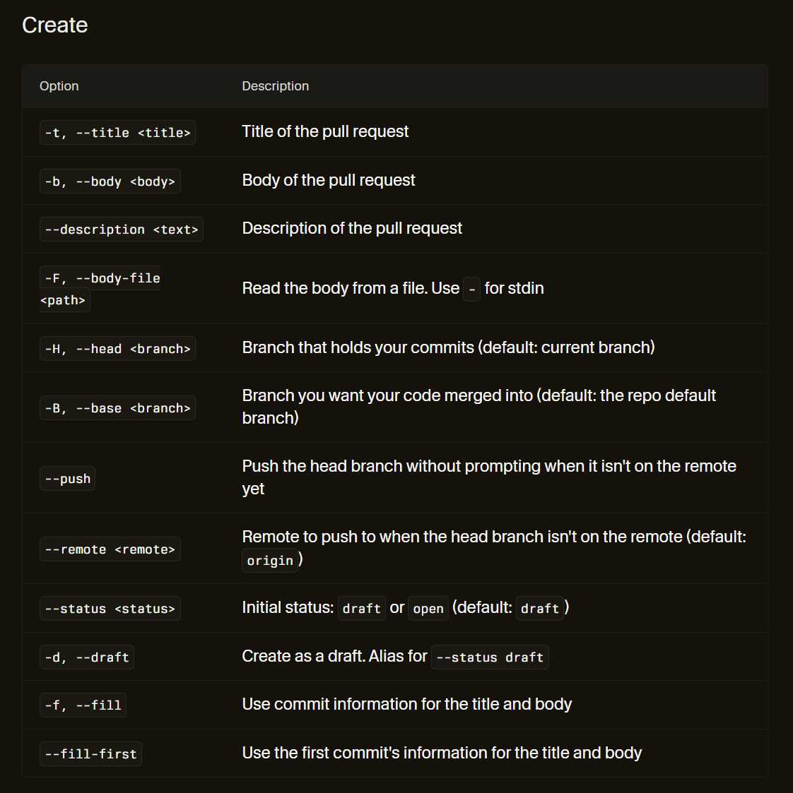
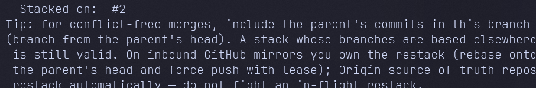
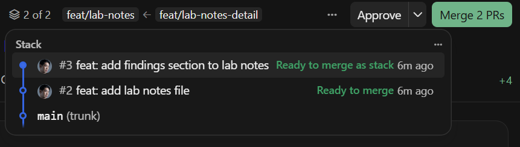
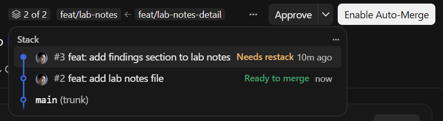
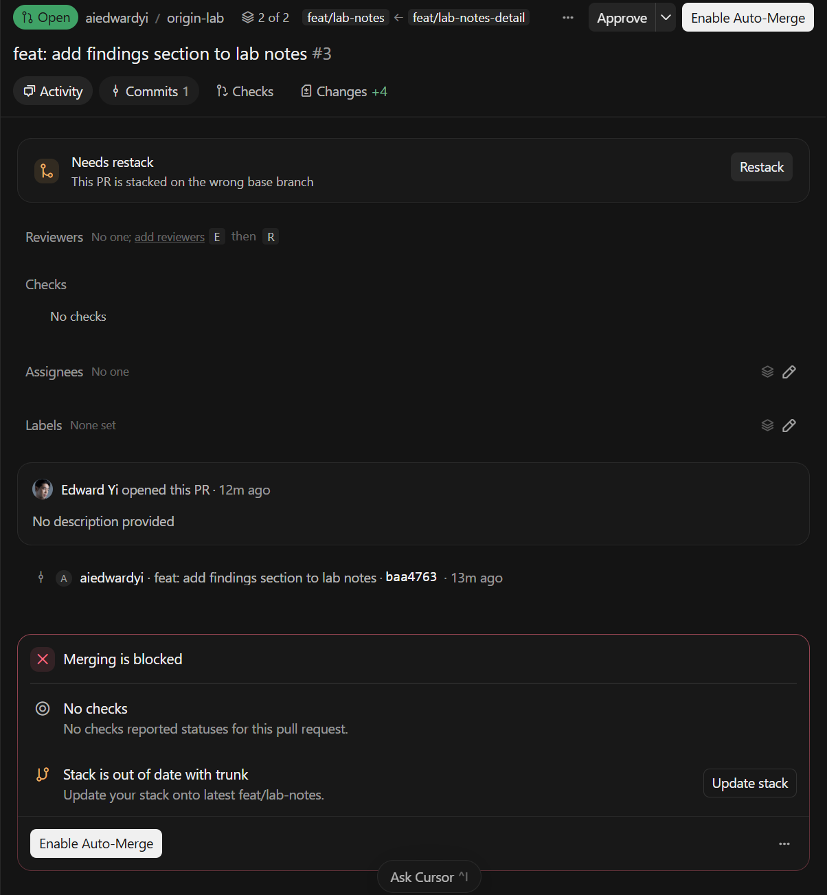
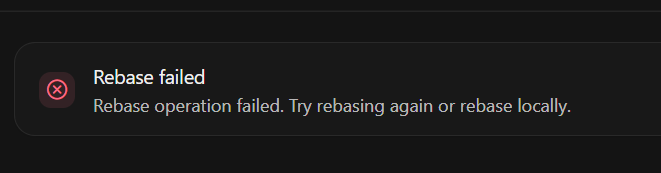
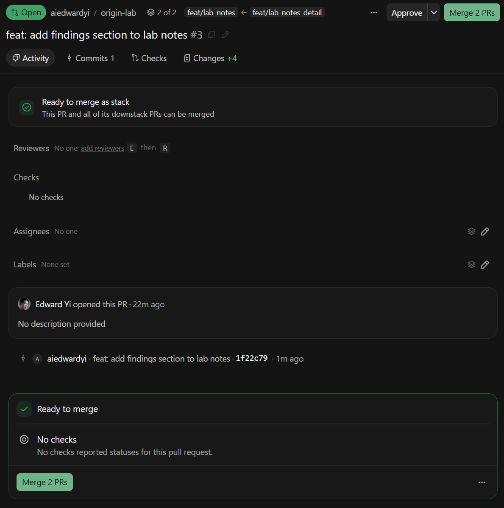

# Stacked pull requests in Cursor Origin

Origin supports stacked pull requests through an `--stack-on` flag on `origin pr create`.
The flag works today. It is not listed in the official CLI reference or in the CLI's own
`--help` output, so this guide documents how to use it.

Tested 2026-08-20 on an Origin-native repo.

## What a stack is

A stack is a chain of branches, each branched off the one below it, each with its own pull
request. You review them small and merge them bottom-up instead of shipping one large change.

Plain git already allows branching off a branch. What stack support adds is the bookkeeping:
Origin knows the pull requests belong to one stack, shows them as a unit, detects when a
branch below has changed, and rebases the branches above on request.

## The flag is not in the docs

The official CLI reference at `cursor.com/docs/origin/cli/reference/pull-requests` states it
lists every `origin pr` subcommand with its options. The `create` table lists 12 options and
`--stack-on` is not among them.



The flag is also absent from `origin pr create --help` as its own entry. It appears only
inside the description of another flag, where `--base` is documented as defaulting to "the
--stack-on parent's head branch, else the repo default branch".

The published docs describe the same `--base` default as simply "the repo default branch".

## Creating a stack

Open the first pull request normally:

```bash
git checkout -b feat/lab-notes
# make changes, commit
origin pr create --push --status open -f
```

`--push` sends the branch up, `--status open` skips draft, `-f` fills the title and body
from the commit message.

Branch the second change off the first, not off main:

```bash
git checkout -b feat/lab-notes-detail
# make changes, commit
origin pr create --push --status open -f --stack-on 2
```

`--stack-on` takes the parent pull request number. The output confirms the link:



That tip text does not appear in the published docs. It states that on inbound GitHub
mirrors you own the restack yourself, while Origin-source-of-truth repos restack
automatically.

The web UI then shows the stack as a unit, with a merge button covering both pull requests:



## What happens when the parent changes

Push a new commit to the parent branch and the stack goes stale immediately:



Merging is blocked until the stack is updated:



This is worth stating plainly, because the CLI tip suggests otherwise: **restacking is not
automatic.** It did not happen on its own for a conflicting change or for a clean,
non-overlapping one. In both cases Origin waited for the Restack button.

Clicking Restack on a clean change works. Origin rebases the branch server-side and the
stack goes green again:


## When Restack fails

If the parent's change conflicts with the child's, the button gives up:



Origin is correct to refuse here. A real content conflict needs a person. Resolve it locally:

```bash
git checkout feat/lab-notes-detail
git rebase feat/lab-notes
# fix the conflict markers in the file, then
git add <file>
git rebase --continue
git push --force-with-lease
```

Rebasing rewrites commits, so the hashes change and a plain push is rejected. Use
`--force-with-lease` rather than `--force`: it refuses if someone else pushed to the branch
since your last fetch.

The stack returns to a mergeable state:



## Gotchas

| Thing | Detail |
|---|---|
| `--stack-on` value | The parent pull request number, not a branch name |
| Restacking | Never automatic. Always a button click or a local rebase |
| Conflicts | The Restack button fails. Rebase locally and force-push with lease |
| Force pushing | Use `--force-with-lease`, never plain `--force` |
| Base branch | With `--stack-on`, `--base` defaults to the parent's head branch |
| Merge button | Says "Merge N PRs" and merges the whole stack bottom-up |

## Notes

Origin is in early beta and this behavior may change. Everything above was verified
firsthand on 2026-08-20 against an Origin-native repo, Origin CLI 2026.08.15-22-58-04-922a05a.
